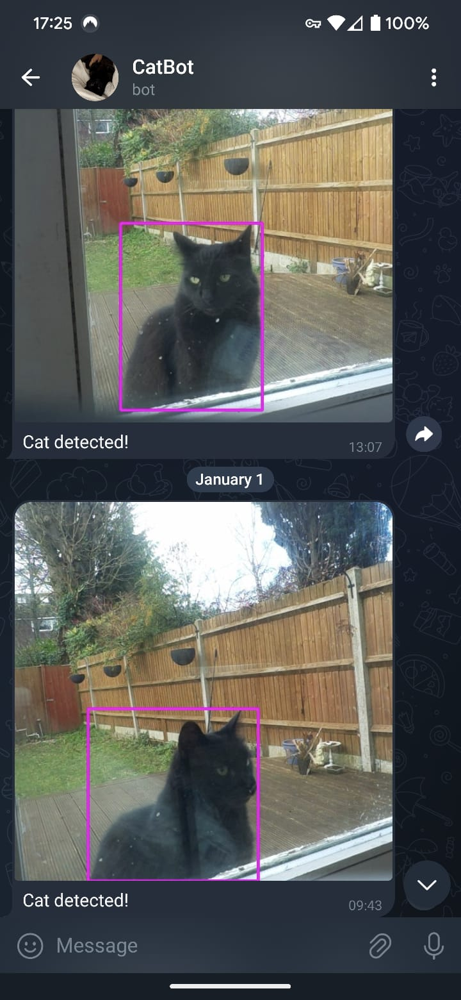

# CatBot




### Backstory
Meet CatBot - a little project that turned into a big adventure! It all started with a friendly neighborhood cat that made my doorstep. This furry friend would pop by daily for some cozy time, especially during the cold winter months. Problem was, with me working away in my office, I often missed its visits, and leaving the door open in winter wasn't exactly ideal. Enter CatBot! This nifty system now lets me know when my four-legged buddy is waiting outside.

This journey wasn't just about keeping my feline friend comfy. It was also a deep dive into the world of edge computing and efficient deployment of object detection models. And hey, why not make it more convenient with Telegram notifications?

---

### Description
CatBot is a Raspberry Pi-based cat detection system. It uses a camera module for capturing images and YOLOv8 model to detect our feline visitor. When the cat is at the door, I get a notification on Telegram. No more missed hangouts!

---

### Features

- Real-time cat detection using a camera module.
- Telegram notifications with images upon detection.
- Optimized for Raspberry Pi 5 performance.
- ONNX model inference.

---

### Requirements

- Raspberry Pi 5
- Camera Module
- Python 3.x
- OpenCV
- YOLOv8
- Telegram Bot API Token
- Onnx

---

### Setup

```
sudo apt update && apt list --upgradable
sudo apt upgrade -y && sudo apt dist-upgrade -y
```

```
sudo apt autoremove
sudo apt autoclean
```

- Setup the python environment
```
sudo apt install python3 python3-pip python3-dev python3-venv
sudo apt install libopenblas-dev
sudo apt install libatlas-base-dev
```

```
mkdir venvs
cd venvs

python3 -m venv yolocat --system-site-packages  # Necessary flag to use Picamera2 in a virtual environment
source ~/venvs/yolocat/bin/activate
```

- Clone the repository
```
cd ~
git clone https://github.com/rohan1198/CatBot.git
cd ~/CatBot
```

- Install python packages
```
pip install -r requirements.txt
```

- Create and populate the .env file
```
cd ~/CatBot
touch .env
```

- The .env file should have the following fields
```
TELEGRAM_BOT_TOKEN=your_bot_token  (get this from botfather)
TELEGRAM_CHAT_ID=your_chat_id      (get this from userinfobot)
MODEL_PATH=path/to/model.onnx
```

- Modify path in cat_detector.sh
```
VENV_PATH="/home/raspi/venvs/yolocat/bin/activate"

chmod +x cat_detector.sh
```

- Modify the path in catbot.service
```
ExecStart=/bin/bash path/to/CatBot/cat_detector.sh
```

- Autostart
```
cd ~/CatBot

sudo cp ~/CatBot/catbot.service /etc/systemd/system/

sudo systemctl enable catbot.service
sudo systemctl start catbot.service
```


---

### To Do

- Collect data with the cat and train a custom yolov8l model.
- Train model with quantization.
- Sparsify model for faster inference.
- Test new model.
